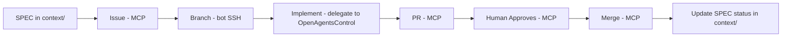

# Concept: Workflow System

**Core Idea**: GitHub automation flows from SPEC (context file) through PR merge, 
with bot actions requiring human approval at key stages.

**Key Points**:
- Flow: SPEC (context/{cat}/{NNN-feature}.md) → Issue → Branch (git/SSH) → Implement → Test → PR → Human Review → Merge
- SPEC files ARE **context files** (discoverable by ContextScout)
- GitHub API actions use MCP (never direct API/gh CLI)
- Git operations (branch, commit, push) use bot SSH key (exception - no MCP tools exist)
- Copilot review comments must be addressed before merge
- After merge: Update SPEC status to `completed` (stays in context/ - no archiving)

**Quick Example**:

**Context Integration**:
- SPEC files: `.opencode/context/{category}/{NNN-feature}.md` (directly in category)
- Loaded by: ContextScout (discovery), OpenAgentsControl agents (context loading)

**Reference**: https://github.com/calavia-org/opencode-hub
**Related**: guides/github-workflow-rules.md, concepts/spec-driven-process.md
