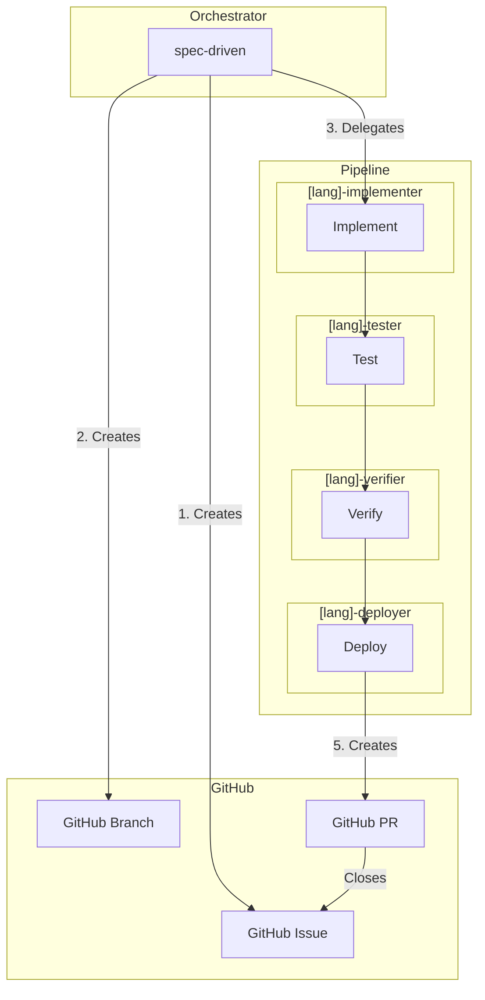
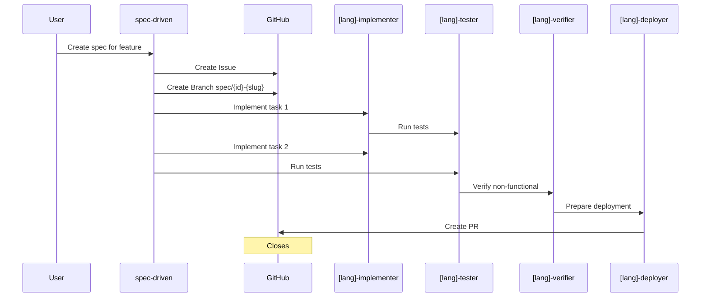

# Calavia OpenCode Hub

Centralized OpenCode configuration for our organization.

**Unified Documentation**: All docs are `.md` files - served directly on Vercel or rendered as HTML via `marked.js`.

Stack: **Java/Kotlin, Python, Go, Terraform** + **Docker/Portainer/Kubernetes**

## Quick Start (Pure Remote Config)

OpenCode auto-loads config from `https://opencode.calavia.org/.well-known/opencode.json`:

### One-Time Setup (First Time Only)
```bash
# 1. Install OpenCode CLI
npm install -g opencode

# 2. Clone the hub (one-time, sets up remote config discovery)
git clone https://github.com/calavia-org/opencode-hub.git
cd opencode-hub
opencode  # Loads config from .well-known/opencode.json
# → Remembers baseUrl for future use
```

### Daily Development (Any Project)
```bash
# 3. Add tokens to your profile
echo 'export OPENCODE_BOT_TOKEN="ghp_..."' >> ~/.zshrc
echo 'export HUMAN_TOKEN="ghp_..."' >> ~/.zshrc
echo 'export CONTEXT7_API_KEY="ctx7_..."' >> ~/.zshrc
echo 'export GIT_SSH_COMMAND="ssh -i ~/.ssh/opencode_bot"' >> ~/.zshrc
source ~/.zshrc

# 4. Start OpenCode in ANY project (auto-loads remote config)
cd /path/to/your-project
opencode
# → Uses cached baseUrl from hub setup
# → Inherits agents/skills from OpenAgentsControl via URL
```

**What happens:**
1. OpenCode reads `https://opencode.calavia.org/.well-known/opencode.json`
2. Loads `spec-driven` agent from this Vercel deployment
3. Inherits tech-specific agents from OpenAgentsControl URLs
4. Loads SPEC files from `.opencode/context/` (if repo has them)

**What happens:**
1. OpenCode reads `https://opencode.calavia.org/.well-known/opencode.json`
2. Auto-loads `spec-driven` agent from this Vercel deployment
3. Inherits tech-specific agents from OpenAgentsControl URLs
4. Loads SPEC files from `.opencode/context/` (if repo has them)

**What's served by this Vercel deployment:**
- ✓ 1 agent (`spec-driven` orchestrator - unique to this hub)
- ✓ 2 skills (`spec-driven`, `github-workflow`)
- ✓ SPEC files in `.opencode/context/`
- ✓ Documentation (.md files)

**Inherited from OpenAgentsControl (via URL - no local install needed):**
- • Tech-specific agents (go, python, java, etc.)
- • Tech-specific skills
- • Modes, tools, commands

## Architecture



## GitHub Workflow



## Available Agents

| Agent | Description |
|-------|-------------|
| `spec-driven` | SPEC-driven development orchestrator (unique to this hub) |

**Inherited from OpenAgentsControl (via URL):**
- Tech-specific agents (go, python, java, terraform, etc.)

## Available Modes (Inherited from OpenAgentsControl via URL)

All modes are inherited from OpenAgentsControl. See: `https://opencode.calavia.org/modes`

## Available Skills

| Skill | Description |
|-------|-------------|
| `spec-driven` | Create and manage SPEC files (context files) |
| `github-workflow` | GitHub automation (issues, branches, PRs) |

**What's served by this Vercel deployment:**
- ✓ 2 skills (`spec-driven`, `github-workflow`)

**Inherited from OpenAgentsControl (via URL):**
- • Tech-specific skills

## Token Configuration

Tokens are documented in **Quick Start** section above.

**Summary:**
- `OPENCODE_BOT_TOKEN` - Bot automation (create branches, PRs, merge)
- `HUMAN_TOKEN` - Human approvals (review, approve PRs)
- `CONTEXT7_API_KEY` - Library documentation (optional)

## Workflow

### Human Approval Flow

```
Human defines SPEC
      ↓
Bot creates SPEC, branch, implements
      ↓
Bot opens PR
      ↓
Bot WAITS for human approval
      ↓
Human approves in GitHub UI
      ↓
Bot executes merge
      ↓
GitHub Action archives SPEC
```

## SPEC Files (Context System)

All SPEC files are stored directly in context categories (SPEC files ARE context files):

```
.opencode/context/
├── core/
│   ├── 001-spec-driven-process.md       # SPEC file (IS context)
│   └── 002-context-structure.md         # SPEC file (IS context)
├── development/
│   ├── 001-add-auth.md                  # SPEC file
│   └── 002-fix-api.md                   # SPEC file
└── ...
```

**Key**: 
- SPEC files live directly in `.opencode/context/{category}/` (no `.specs/` folder)
- No archiving - completed SPECs stay in context/{category}/ with status `completed`
- ContextScout discovers SPEC files automatically (no index needed)

### Naming Convention

- **Pattern**: `.opencode/context/{category}/{NNN-feature-slug}.md`
- **Branch**: `spec/{issue-number}-{feature-slug}`
- **Example**: `.opencode/context/development/001-add-auth.md` → branch `spec/001-add-auth`

### Workflow

1. **Create SPEC** → Save to `.opencode/context/{category}/{NNN}-{slug}.md`
2. **GitHub Issue** → Automatically created with `spec` and `approved` labels
3. **Feature Branch** → `spec/{issue}-{slug}`
4. **Implement** → Track tasks in SPEC and issue
5. **PR** → Contains "Closes #{issue}" reference
6. **Complete** → Update SPEC status to `completed` (no archiving, stays in context/{category}/)

### Quick Commands

```bash
# List all SPEC files (they're context files)
find .opencode/context -name "[0-9][0-9][0-9]-*.md"

# View SPEC files in core/
ls .opencode/context/core/[0-9]*.md

# View SPEC files in development/
ls .opencode/context/development/[0-9]*.md

# ContextScout automatically discovers SPEC files (no index needed)
```

## Structure (Minimal Hub with Remote Inheritance)

```
agents/                    # 1 agent (spec-driven orchestrator - unique to this hub)
skills/                    # 2 skills (spec-driven, github-workflow)
.opencode/
  ├── context/             # Hub-specific context files ONLY
  │   ├── core/           # SPEC files + hub guides (local)
  │   └── ...             # (other categories inherited remotely)
  ├── config/
  │   └── paths.json      # Remote inheritance config
  └── ...
.github/                  # PR template, workflows
SPEC.template.md           # Template for new SPEC files
docs/                      # Documentation (.md files only)
```

**Key**: 
- **Local**: Only hub-specific files (SPEC files, spec-driven agent, 2 skills)
- **Remote**: Tech-specific agents/skills/modes/tools **inherited from OpenAgentsControl via URL**
- **Configured in**: `.opencode/config/paths.json` (remote inheritance)
- **No local copies**: 100+ OpenAgentsControl files NOT stored here
- **Unified docs**: `.md` files work on GitHub + Vercel (via marked.js)

## Documentation (Unified .md)

All documentation lives in `.md` files - single source of truth:
- **GitHub**: Rendered natively by GitHub
- **Vercel**: Dynamically loaded via `marked.js` (see `index.html`)
- **No duplication**: No `.html` duplicates - Vercel converts `.md` → HTML on the fly

### Quick Links
- [SPEC Process](docs/SPEC-process.md) - How to create and manage SPEC files
- [Workflows](docs/workflows.md) - Development workflows and patterns
- [Token Setup](docs/tokens.md) - Configure BOT_TOKEN, HUMAN_TOKEN, CONTEXT7_API_KEY
- [Project Setup](PROJECT-SETUP.md) - Pure remote config (no local clone needed)

## Deploy (Vercel)

Deployed on Vercel: **https://opencode.calavia.org/**

**How it works:**
1. Vercel serves this repo's files (`.md`, `.json`, etc.)
2. OpenCode auto-loads from `https://opencode.calavia.org/.well-known/opencode.json`
3. All tech-specific agents/skills **inherited from OpenAgentsControl via URLs** (no local copies)

### Pure Remote Config
- No local clone needed
- OpenCode auto-loads remote config on startup
- See **Quick Start** section above

### Build (Optional)
For better SEO, Vercel can convert `.md` to `.html` on the fly using `marked.js` (see `index.html`).

**No build step needed** - files are served statically.