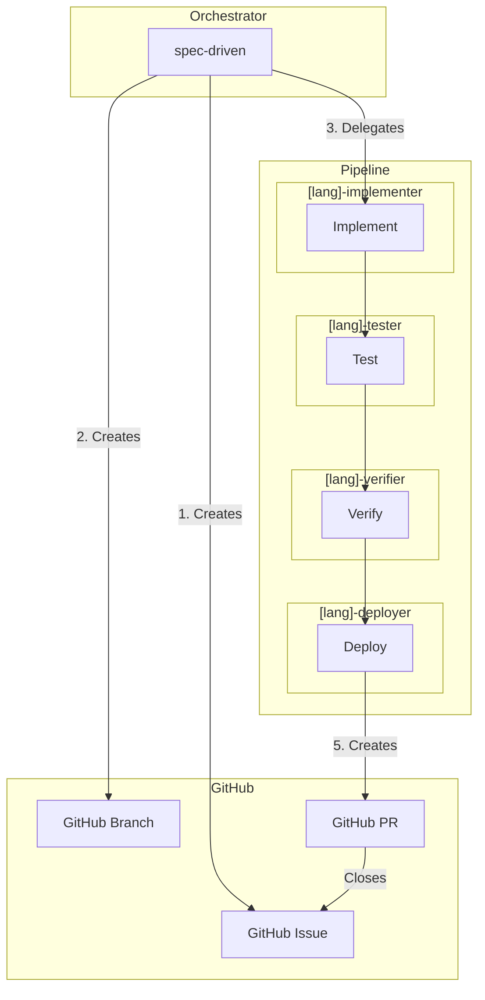
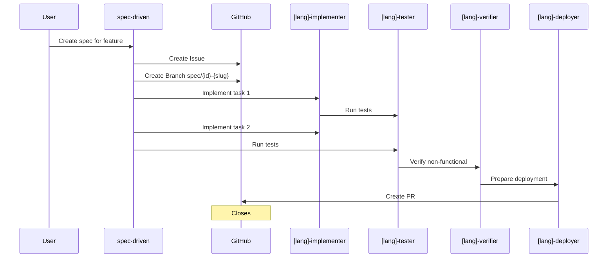

# Calavia OpenCode Hub

Centralized OpenCode configuration for our organization.

Stack: **Java/Kotlin, Python, Go** + **Docker/Portainer/Kubernetes**

## Quick Start

```bash
export OPENCODE_CONFIG_URL=https://opencode.calavia.org/.well-known/opencode.json
export GITHUB_TOKEN=ghp_your_token_here
opencode
```

## Architecture



## GitHub Workflow



## Available Agents

### Orchestrator
| Agent | Description |
|-------|-------------|
| `spec-driven` | SPEC-driven development orchestrator |

### Java/Kotlin Pipeline
| Agent | Description |
|-------|-------------|
| `java-implementer` | Implements Java code |
| `java-tester` | Runs JUnit tests |
| `java-verifier` | Validates non-functional |
| `java-deployer` | Deploys to Docker/K8s |

### Python Pipeline
| Agent | Description |
|-------|-------------|
| `python-implementer` | Implements Python code |
| `python-tester` | Runs pytest tests |
| `python-verifier` | Validates non-functional |
| `python-deployer` | Deploys to Docker/K8s |

### Go Pipeline
| Agent | Description |
|-------|-------------|
| `go-implementer` | Implements Go code |
| `go-tester` | Runs Go tests |
| `go-verifier` | Validates non-functional |
| `go-deployer` | Deploys to Docker/K8s |

## Available Modes

| Mode | Description |
|------|-------------|
| `spec-driven` | SPEC-driven development workflow |

## Available Skills

| Skill | Description |
|-------|-------------|
| `spec-driven` | Create specs |
| `github-workflow` | GitHub issue/branch/PR automation |
| `root-cause-analysis` | Debug distributed systems |
| `repo-bootstrap` | Project setup |

## Structure

```
agents/          # 13 agents
modes/           # 1 mode
skills/          # 4 skills
commands/        # 1 command
SPEC.template.md
```

## Deploy

Deployed on Vercel: https://opencode.calavia.org