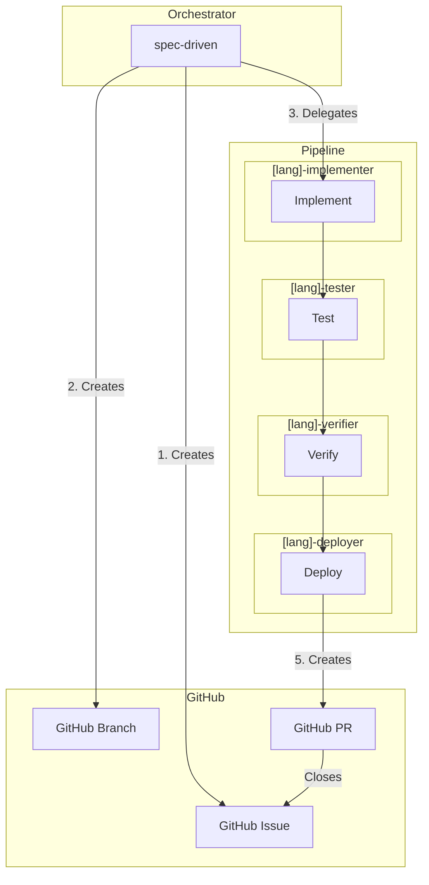
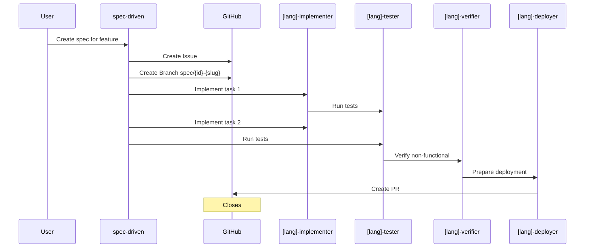

# Calavia OpenCode Hub

Centralized OpenCode configuration for our organization.

Stack: **Java/Kotlin, Python, Go, Terraform** + **Docker/Portainer/Kubernetes**

## Quick Start

```bash
# One-time setup
curl -sL https://opencode.calavia.org/setup.sh | bash

# Add to your profile
echo 'export OPENCODE_CONFIG_DIR=~/.config/opencode' >> ~/.zshrc
echo 'export GITHUB_TOKEN=ghp_your_token_here' >> ~/.zshrc

# Start
source ~/.zshrc
opencode
```

## Architecture



## GitHub Workflow



## Available Agents

### Orchestrator
| Agent | Description |
|-------|-------------|
| `spec-driven` | SPEC-driven development orchestrator |

### Java/Kotlin Pipeline
| Agent | Description |
|-------|-------------|
| `java-implementer` | Implements Java code |
| `java-tester` | Runs JUnit tests |
| `java-verifier` | Validates non-functional |
| `java-deployer` | Deploys to Docker/K8s |

### Python Pipeline
| Agent | Description |
|-------|-------------|
| `python-implementer` | Implements Python code |
| `python-tester` | Runs pytest tests |
| `python-verifier` | Validates non-functional |
| `python-deployer` | Deploys to Docker/K8s |

### Go Pipeline
| Agent | Description |
|-------|-------------|
| `go-implementer` | Implements Go code |
| `go-tester` | Runs Go tests |
| `go-verifier` | Validates non-functional |
| `go-deployer` | Deploys to Docker/K8s |

### Terraform Pipeline
| Agent | Description |
|-------|-------------|
| `terraform-implementer` | Writes Terraform infrastructure code |
| `terraform-tester` | Tests and security scans |
| `terraform-verifier` | TFLint, checkov, OPA validation |
| `terraform-deployer` | Deploys to Terraform Cloud |

## Available Modes

| Mode | Description |
|------|-------------|
| `spec-driven` | SPEC-driven development workflow |

## Available Skills

| Skill | Description |
|-------|-------------|
| `spec-driven` | Create specs |
| `github-workflow` | GitHub issue/branch/PR automation |
| `root-cause-analysis` | Debug distributed systems |
| `repo-bootstrap` | Project setup |
| `context7` | Up-to-date library docs |

## MCP Configuration

### GitHub MCP (required)
```bash
export GITHUB_TOKEN="ghp_..."
```

### Context7 MCP (required for implementers)
```bash
export CONTEXT7_API_KEY="ctx7_..."
```

Then add to your `opencode.json`:
```json
{
  "mcp": {
    "github": { "url": "https://api.githubcopilot.com/mcp/" },
    "context7": { "url": "https://mcp.context7.com/mcp" }
  }
}
```

## Examples

### With Context7
```
User: "Create a React useState counter"
→ Context7 fetches React 19 docs
→ Returns: useState<number>(0, { method: 'sync' })
```

### Without Context7
```
User: "Create a React useState counter"
→ Uses training data (possibly outdated)
→ May return incorrect API
```

## SPEC Tracking

All project specifications are tracked in the `/.specs/` directory with full GitHub workflow integration.

### Directory Structure

```
/.specs/
├── README.md              # Index of all SPECs
├── archived/              # Completed/cancelled SPECs
├── 001-feature-name.md    # Active SPECs
└── ...
```

### Naming Convention

- **Pattern**: `/{issue-number}-{feature-slug}.md`
- **Branch**: `spec/{issue-number}-{feature-slug}`
- **Example**: `001-user-authentication.md` → branch `spec/001-user-authentication`

### Workflow

1. **Create SPEC** → Save to `/.specs/{issue}-{slug}.md`
2. **GitHub Issue** → Automatically created with `spec` label
3. **Feature Branch** → `spec/{issue}-{slug}`
4. **Implement** → Track tasks in SPEC and issue
5. **PR** → Contains "Closes #{issue}" reference
6. **Archive** → Move completed SPEC to `/.specs/archived/`

### SPEC Status States

| Status | Description |
|--------|-------------|
| Draft | Initial creation |
| In Review | Under stakeholder review |
| Approved | Ready for implementation |
| In Progress | Actively being developed |
| Completed | PR merged |
| Cancelled | Abandoned or superseded |

### Quick Commands

```bash
# List all SPECs
cat .specs/README.md

# View active SPECs
ls .specs/*.md

# View archived SPECs
ls .specs/archived/
```

## Structure

```
agents/          # 17 agents
modes/           # 1 mode
skills/          # 5 skills
commands/        # 1 command
.specs/          # SPEC tracking directory
.github/         # PR template
SPEC.template.md
```

## Deploy

Deployed on Vercel: https://opencode.calavia.org