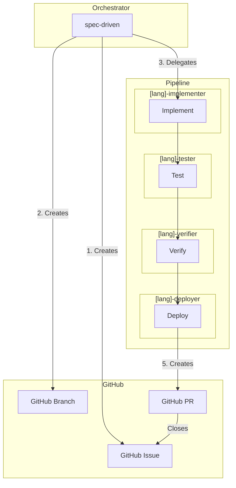
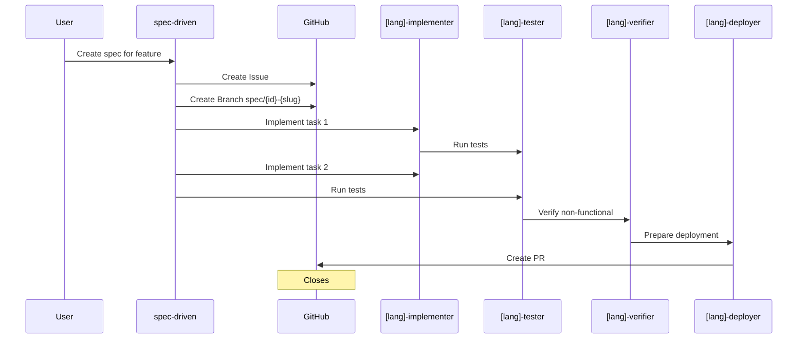
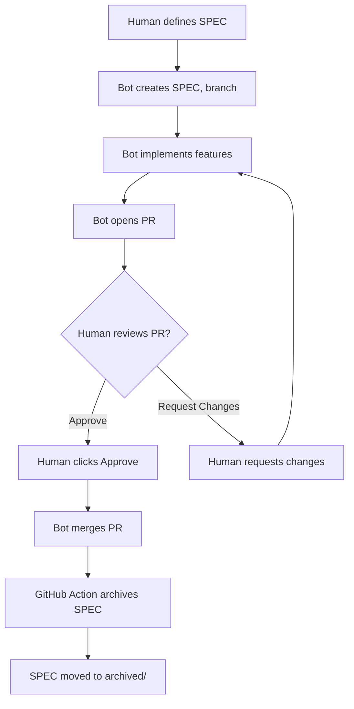
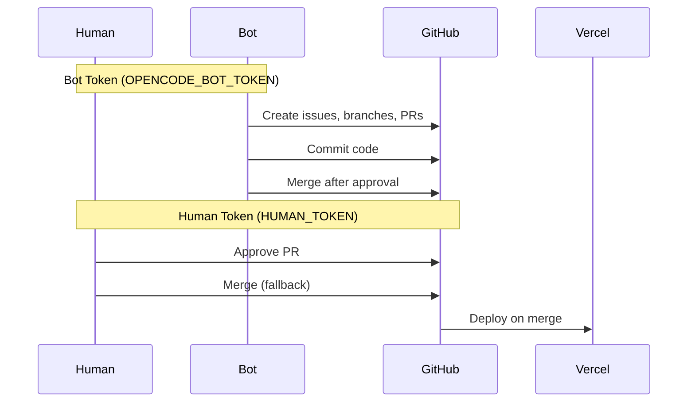
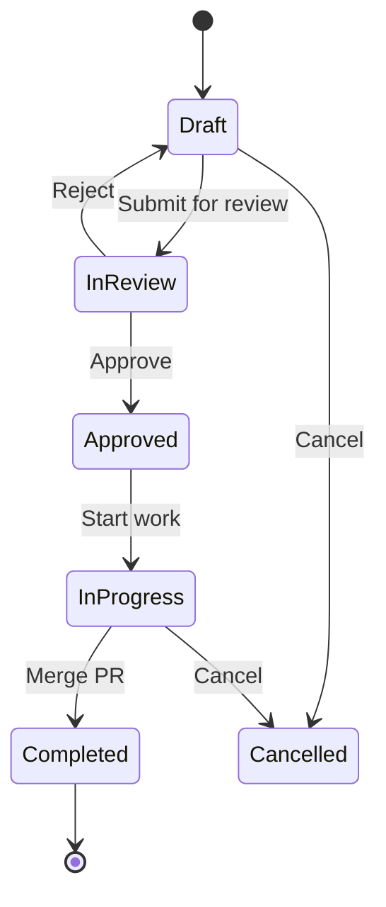

# Workflows & Diagrams

Visual representations of the SPEC-driven development workflow.

## Architecture Overview

## Agent Pipeline Flow

## Human Approval Flow

## Token Flow

## Agent Specialization Matrix

| Stage | Java | Python | Go | Terraform |
|-------|------|--------|---|------------|
| Implement | java-implementer | python-implementer | go-implementer | terraform-implementer |
| Test | java-tester | python-tester | go-tester | terraform-tester |
| Verify | java-verifier | python-verifier | go-verifier | terraform-verifier |
| Deploy | java-deployer | python-deployer | go-deployer | terraform-deployer |

## GitHub Issue Lifecycle

## Quick Reference

| Step | Command | Description |
|------|---------|-------------|
| 1 | SPEC created | Feature specified in `.specs/` |
| 2 | `gh issue create` | GitHub issue with SPEC |
| 3 | `git checkout -b spec/NNN-*` | Feature branch |
| 4 | Implement + tests | Code with verification |
| 5 | `gh pr create` | Pull request |
| 6 | Review + merge | Human approval |
| 7 | Archive | Move to `.specs/archived/` |

## Related

- [SPEC Process](./SPEC-process.md)
- [Token Setup](./tokens.md)
- [GitHub Repository](https://github.com/calavia-org/opencode-hub)