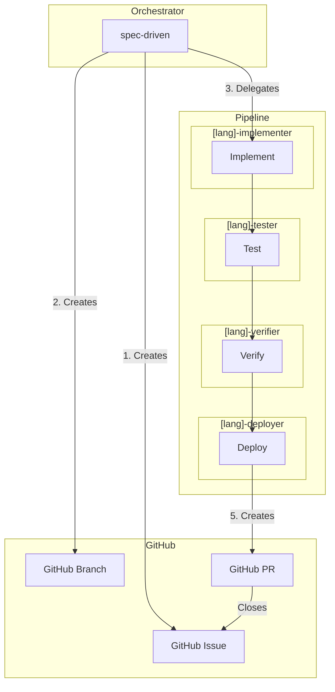
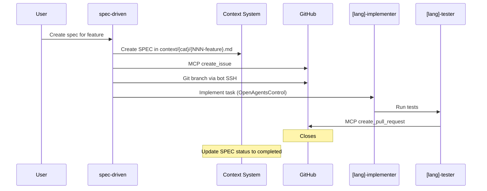
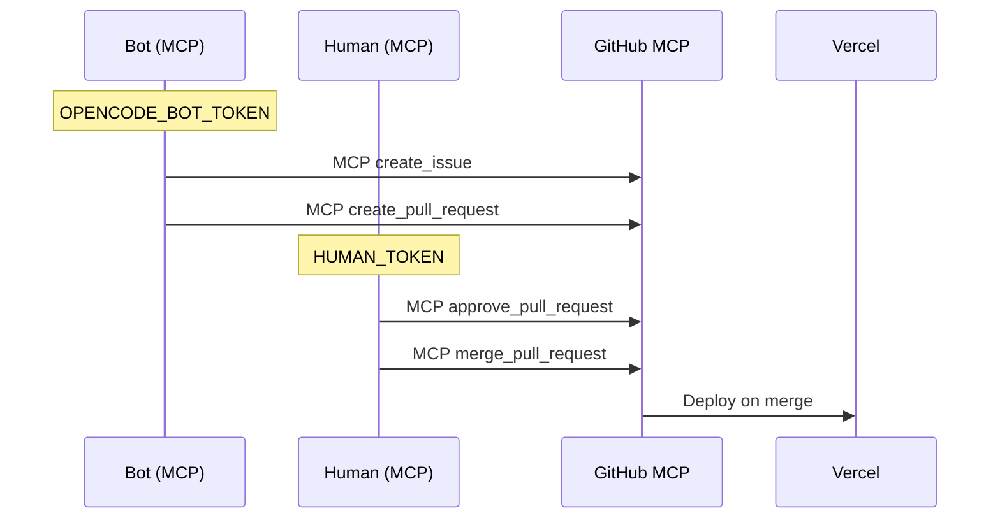
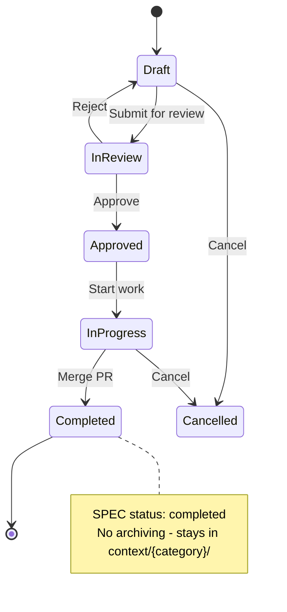

# Workflows & Diagrams

Visual representations of the SPEC-driven development workflow.

## Architecture Overview



## Agent Pipeline Flow



## Human Approval Flow

```mermaid
flowchart TD
    A[Human defines SPEC] --> B[Bot creates SPEC, branch via SSH]
    B --> C[Bot implements features]
    C --> D[Bot opens PR via MCP]
    D --> E{Human reviews PR?}
    E -->|Approve| F[Human approves via MCP]
    E -->|Request Changes| G[Human requests changes]
    F --> H[Human merges via MCP]
    G --> C
    H --> I[Update SPEC status to completed]
    I --> J[SPEC stays in context/{category}/ - no archiving]
```

## Token Flow

ALL GitHub actions MUST use MCP. Direct API calls are NOT allowed.



## MCP Token Rules

| Step | Token | MCP Server | Tool |
|------|-------|-----------|------|
| Create Issue | `OPENCODE_BOT_TOKEN` | github_bot | `create_issue` |
| Create PR | `OPENCODE_BOT_TOKEN` | github_bot | `create_pull_request` |
| Review PR | `HUMAN_TOKEN` | github_human | `add_comment_to_pending_review` |
| Approve | `HUMAN_TOKEN` | github_human | `approve_pull_request` |
| Merge | `HUMAN_TOKEN` | github_human | `merge_pull_request` |

> **Important:** Never use direct API calls (curl) for GitHub actions. Always use MCP.

## Agent Specialization Matrix

| Stage | Java | Python | Go | Terraform |
|-------|------|--------|---|------------|
| Implement | java-implementer | python-implementer | go-implementer | terraform-implementer |
| Test | java-tester | python-tester | go-tester | terraform-tester |
| Verify | java-verifier | python-verifier | go-verifier | terraform-verifier |
| Deploy | java-deployer | python-deployer | go-deployer | terraform-deployer |

## GitHub Issue Lifecycle



## Quick Reference

| Step | Command | Description |
|------|---------|-------------|
| 1 | SPEC created | Feature specified in `context/{category}/` |
| 2 | MCP `create_issue` | GitHub issue with SPEC |
| 3 | `git checkout -b spec/NNN-*` (SSH) | Feature branch (exception) |
| 4 | Implement + tests | Code with verification |
| 5 | MCP `create_pull_request` | Pull request |
| 6 | Review + merge | Human approval (MCP) |
| 7 | Complete | Update SPEC status to `completed` |

## Related

- [SPEC Process](./SPEC-process.md)
- [Token Setup](./tokens.md)
- [GitHub Repository](https://github.com/calavia-org/opencode-hub)